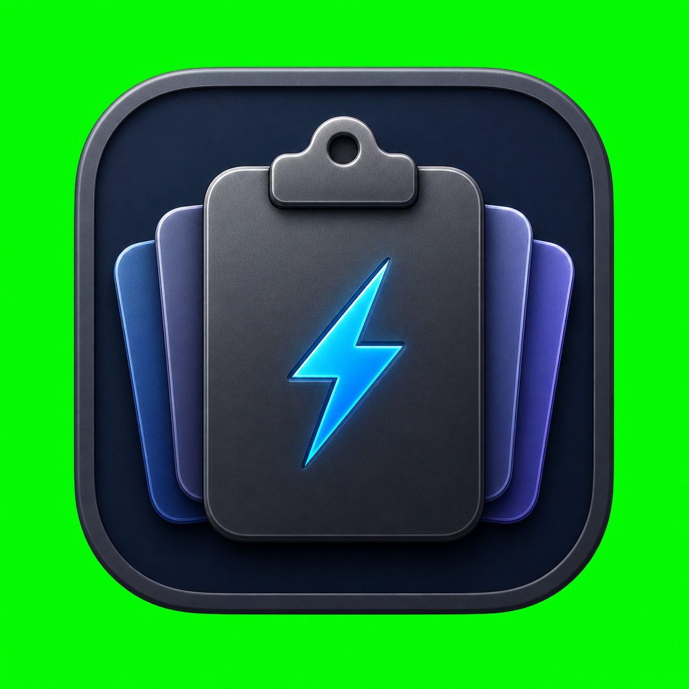

# 📋 CPBoard

  

<h3 align="center">极简、极致、原生的 macOS 剪贴板历史管理工具</h3>

  
  
  

---

## ✨ 为什么选择 CPBoard？

在 macOS 上，剪贴板是最高频使用的系统功能之一。然而，许多现有的剪贴板管理工具要么臃肿缓慢，要么过度收集隐私。

**CPBoard** 是一款完全为 macOS 量身定制的剪贴板历史工具。我们使用 **SwiftUI + AppKit** 纯原生构建，无任何臃肿依赖，以菜单栏（MenuBar）应用的形式静默运行。它不仅拥有极快的响应速度，更将用户的隐私和数据安全放在第一位。

---

## 🌟 核心特性

### 🚀 极致的原生性能与体验
* **轻量常驻**：不占用 Dock 栏，静默守候在系统菜单栏，随时待命。
* **瞬时唤起**：通过全局热键（默认 `⌥ Space`，支持自定义冲突检测）瞬间呼出历史窗口。
* **无缝自动粘贴**：双击历史条目或按回车，CPBoard 会自动将内容写回剪贴板，智能切回前一个应用并自动触发 `⌘V` 粘贴，流畅一气呵成。

### 🧠 智能捕获与去重
* **全格式支持**：不仅支持纯文本，还能完美保留 HTML、富文本 (RTF)、图片 (PNG/JPEG/TIFF) 以及 PDF 文档。
* **智能去重**：基于 SHA-256 内容指纹去重。重复复制相同内容时，仅将已有记录移至最顶端，绝不产生冗余垃圾数据。
* **高效预览**：针对复杂内容自动添加类型标签（文本、图片、PDF 等），并为图片条目生成精致的缩略图预览（最大边 320px）。
* **应用来源追踪**：记录复制内容源自哪个应用，多设备同步或日常检索时一目了然。

### ☁️ iCloud 私有云同步 (可选)
* **无缝多设备同步**：支持通过 iCloud 私有数据库 (`CloudKit`) 进行加密同步，提供统一的剪贴板云端体验。
* **本地安全回退**：若 iCloud 不可用，系统自动退回本地安全存储，不影响任何本地操作。

### 🔒 隐私至上与本地优先
* **沙盒保护**：支持 App Sandbox，无任何后台跟踪或广告行为。
* **持久化数据库**：基于 Core Data + SQLite 的本地高性能存储，大文件外置附件存储，确保数据库轻量敏捷。
* **过滤噪音**：自动过滤仅含空白字符的复制，单条内容大小上限可自主调节（1MB - 100MB），防止巨型文件撑爆存储空间。

### 💳 灵活的双渠道授权
为了满足不同用户的需求，CPBoard 支持双渠道的授权解锁方案：
1. **Mac App Store 版**：支持标准的非消耗型应用内购买 (`com.example.cpboard.pro`)，支持家人共享，一键恢复。
2. **独立分发版 (ZIP/DMG)**：专为不喜欢 App Store 限制的用户设计，支持线下收款，基于安全的 Ed25519 签名算法发放独一无二的许可证密钥激活。

---

## 🛠 软件界面功能预览

| 设置分类 | 包含功能与选项 |
|:---|:---|
| **🔑 解锁激活** | 14 天免费试用、App Store 恢复购买、直接分发版许可证激活 |
| **🌐 语言偏好** | 完整支持 **简体中文** 与 **English** 多语言本地化切换 |
| **⌨️ 全局热键** | 智能冲突检测的快捷键绑定设置 |
| **📦 剪贴板设置** | 单条大小限制过滤（1 / 10 / 50 / 100 MB）、iCloud 同步开关 |
| **💾 存储管理** | 已存数据容量统计、一键清除未置顶/全部数据 |
| **🔌 启动选项** | 随 macOS 登录自动启动 |

---

Made with ❤️ by CPBoard Team

